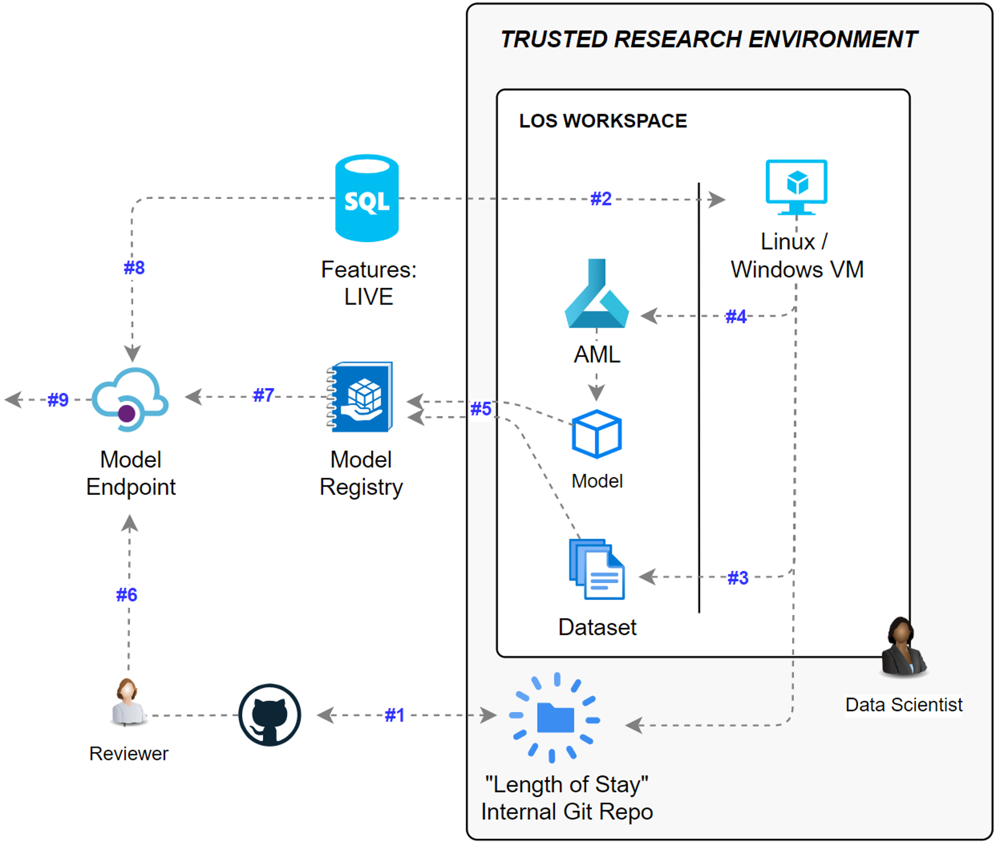

# Model Development and Endpoint Template

## Introduction 

This repo is a starting point for a new Data Science project. It provides a useful structure and development path to follow to provide some consistency to model building projects. 

The code here is yours to use and modify as best suits your work.

### Model Development Walkthrough

Let's follow a diagram to show how we can build and deploy models, using FlowEHR, this repo, and the TRE:

- #1: FlowEHR has created an instance of the `Model-Seedling` repo in GitHub, and your TRE administrator has mirrored it into your workspace via Gitea. That's where you should be reading this doc now. Azure Machine Learning (AML) is also available inside this workspace.
- #2: The SQL Feature Store is accessible from this TRE workspace
- #3: By exploring and creating a SQL query, you'll create a dataset in a format (probably `.csv`), which will be saved locally in the TRE VM you're on for you to investigate. When the dataset looks good, you'll register the dataset with AML. 
- #4: You'll submit a training job to AML. This will pick up the dataset you registered and use it to train a model. The specifics of that training are up to you, but some example code is there to start from. At the end of the training run, a new model should be registered inside AML.
- #5: When the model and dataset are ready, they can be published to the shared registry in FlowEHR.
- #6: A PR from the `main` branch to the `prod` branch of this repo is created, and when merged into `prod`, FlowEHR deploys the model serving code in a container.
- #7: As the model endpoint starts, it downloads the model and associated dataset from the registry.
- #8: The model serving has runtime read-only access to the Feature Store, to pull the latest feature data.
- #9: The user can query the model endpoint for predictions.

# Getting Started

Clone this repo into your TRE VM.

## 1. Update `model.yaml`
The `model.yaml` is used as configuration throughout the code. Update the first half of the file, replacing all the `_CHANGE_ME_` placeholders.

You cannot update the `datasets` or `models` sections yet. Feel free to commit this updated `model.yaml` to the repo - it contains no secrets, and your team members will need the same config.

## 2. Create a Dataset
Whilst you have the freedom to create any dataset you choose (or upload one via the TRE Airlock), the repo will help you create one from the feature store. 

- In the  `./dataset_creation/` directory:
  - Modify the `dataset_query.sql` script to pull the data you need from the feature store
  - Modify the `create_datasets.py` as needed to create / modify the data as needed, finishing with saving the dataset to a local file.
  - In a terminal, run `make create-local-datasets` to execute the python code
  - Update the `datasets` part of `model.yaml` to reference your new local dataset.

## 3. Register a Dataset in AML
When your dataset is ready to be used in training, you can register it in AML.

Run `make register-datasets-in-aml`. This will upload the datasets defined in the `model.yaml` file to AML.

## 4. Create a Training Job
You'll now modify the training code, and then submit that to AML to run a training job on the remote compute cluster.

- In the `./model` directory:
  - The `./src/model.py` and `./src/train.py` contain existing sample code you can modify and reuse in order to train your model
  - By default, the `./main.py` will:
    - Create an environment in AML based from a standard docker image + the `environment.yml` file in the `./model` dir.
    - Push the `./src` folder to AML as a component
    - Reference the first dataset from your `model.yaml`
    - Submit a training job.
- To execute this, run `make train-model-in-aml`

You can view the running experiments, datasets and models in the AML Workspace, within the TRE. When the training has run successfully, you should now have a model. 

Update the `models` section in your `model.yaml` to reflect the name and version of the model you've trained.

## 5. Serve the Model
The `./serve` directory contains all the code to host the model and return predictions to the caller, via a web API (using Fast API).

The `./internal` directory contains some plumbing code that:
- Downloads all models and datasets when the web API starts
- Connects to SQL and Cosmos databases. SQL for the feature store, and cosmos for output logging for monitoring.
- Determines the environment the API is running in (more on that below)
- Instantiates the user code that you will need to modify.

The `./serve.py` file contains any custom code that executes on startup, and then the `run()` function executes when a user calls `http://your-api-host-name/run` - either via a `GET` request containing named query string parameters, or a `POST` request with a JSON payload.

### Serve the model locally
To test the serving code locally, run `make serve-local`. This will spin up the API on a losthost port where you can hit the endpoint via the browser to test and debug it.

### Serve the model for an app developer / in the the app-dev environment
If the `ENVIRONMENT` environment variable is `app-dev`:
- No connections will be made to SQL or Cosmos
- No models or datasets will be downloaded at startup
- The `run_fake()` function will be called instead of the `run()` function. This allows you to output a static response that will mimic a real one. When this model is served in the `app-dev` environment, app developers will be able to call your model endpoint and code against it, being sure that when their app moves into production and they call the real one then the data structures will be as expected. 

To test the app-dev serving locally, run `make serve-local-app-dev`.

## 6. Publish Models and Datasets
A member of the `FlowEHR Algorithm Stewards` AAD group will need to run this step, as they are the only users with access to the shared AML registry in FlowEHR - which hosts models and datasets for production serving.

Run `make publish-assets-in-registry`. This command will loop through all the models and datasets in the `model.yaml` and:
- Download them locally
- Upload them to the AML registry in Production, with the named version

If there is a clash with the name and version, the script will indicate so, and skip that model/dataset.

## 7. Create a PR to App-Dev / Prod
In order to run this code in the production or app-dev environments, you'll need to create a PR into the appropriate branch: `app-dev` or `prod`. 

When the PR has been reviewed and merged, Gitea will sync the repo up to GitHub and the actions will fire to deploy the model serving code. When the serving code runs in app-dev, it will return the fake response. When it runs in production, it will download the models and datasets in the `model.yaml` file.
